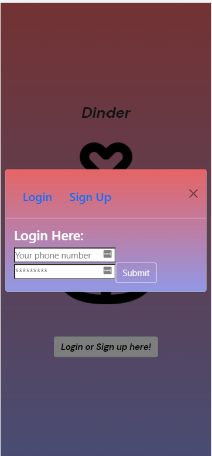

# Dinder

Dinder is a mobile application that allows you to save your favorite dog breeds based on specific characteristics.

While looking at dogs to adopt, there can be so many overwhelming decisions to make. We wanted an app that helps you narrow down your choices that could match the owner’s specific needs in a pet.

## Table of Contents
  
  * [Technologies](#technologies)
  
  * [Usage](#usage)

  * [User-Story](#user-story)
  
  * [Demo](#demo)
  
  * [Team-Members](#team-members)

  * [Deployed-App](#deployed-app)
  
  * [Questions](#questions)
  
## Technologies

### Front End
1. HTML/CSS
2. JavaScript
3. React 
4. React - Bootstrap

### Back End
1. GraphQL
2. Apollo Client
3. Node.js
4. Express.js
5. JWT
6. MongoDB
7. The Dog API

## Usage
This application uses the MERN stack, as well as GraphQL and Apollo Client. Fork and clone down the repository, run "npm install" in the root directory, then run "npm run develop" in the root directory to start both the client and the server.

## User-Story
As an avid dog lover  
I want to find my perfect breed  
So that I can reference my favorites while adopt my new dog.

## Demo

### Login-Page

### Login/Signup-Modal

### Settings-Menu

### Main-Page

### Saved-Dog Page

## Team-Members
<li> Molly Montgomery 
<li> Ronya Gettis
<li> Shaun Sticka
<li> Greg Lanctot

## Deployed-App
Deployed Link:  
 https://doggy-days-frontend.onrender.com

## Questions
If you have any questions regarding the repo please contact Molly: mollymontgomery515@gmail.com, Ronya: klmirg6@gmail.com, Greg: gregory.lanctot28@gmail.com, or Shaun: mnshauntommie@gmail.com.
